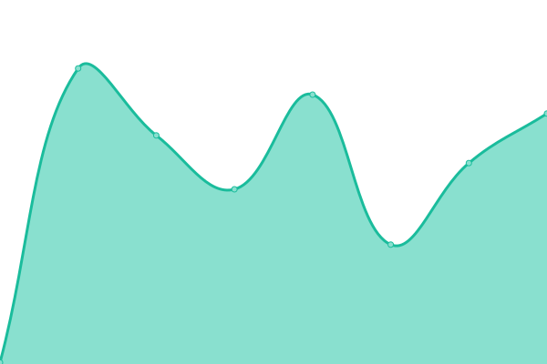
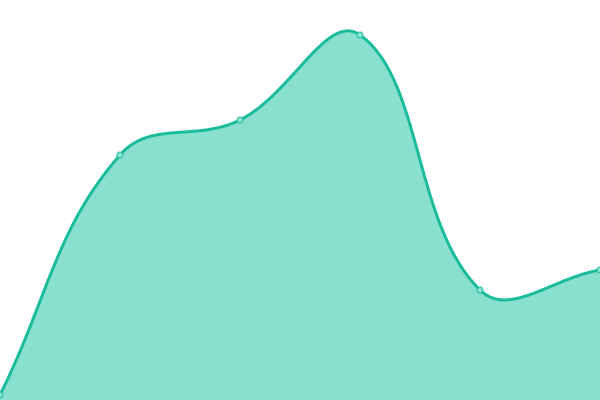
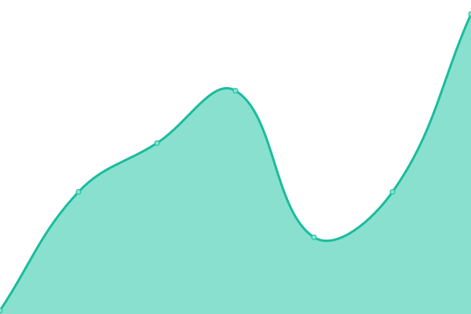
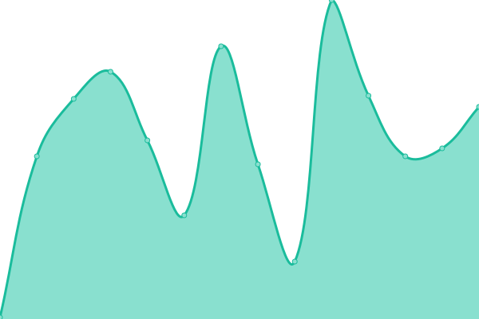
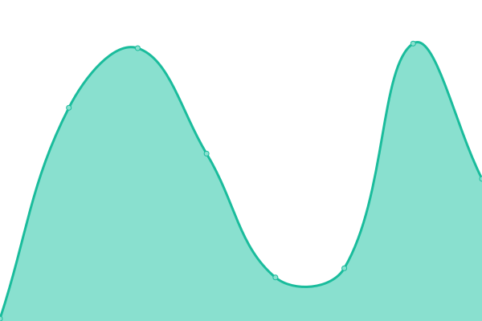

# [📈 Live Status](https://demo.upptime.js.org): <!--live status--> **🟩 All systems operational**

This repository contains the open-source uptime monitor and status page for [Roni](https://demo.upptime.js.org), powered by [Upptime](https://github.com/upptime/upptime).

With [Upptime](https://upptime.js.org), you can get your own unlimited and free uptime monitor and status page, powered entirely by a GitHub repository. We use [Issues](https://github.com/ohmlaws/Upptime/issues) as incident reports, [Actions](https://github.com/ohmlaws/Upptime/actions) as uptime monitors, and [Pages](https://demo.upptime.js.org) for the status page.

<!--start: status pages-->
<!-- This summary is generated by Upptime (https://github.com/upptime/upptime) -->
<!-- Do not edit this manually, your changes will be overwritten -->
<!-- prettier-ignore -->
| URL | Status | History | Response Time | Uptime |
| --- | ------ | ------- | ------------- | ------ |
|  [Ohmlaws](https://ohmlaws.github.io) | 🟩 Up | [ohmlaws.yml](https://github.com/ohmlaws/uptime/commits/HEAD/history/ohmlaws.yml) | 

 161ms
     
 | 

<a href="https://Ohmlaws.github.io/uptime/history/ohmlaws">100.00%</a>
    

|  [First Year](https://ohmlaws.github.io/firstyear/) | 🟩 Up | [first-year.yml](https://github.com/ohmlaws/uptime/commits/HEAD/history/first-year.yml) | 

 75ms
     
 | 

<a href="https://Ohmlaws.github.io/uptime/history/first-year">100.00%</a>
    

|  [Second Year](https://ohmlaws.github.io/secondyear/) | 🟩 Up | [second-year.yml](https://github.com/ohmlaws/uptime/commits/HEAD/history/second-year.yml) | 

 64ms
     
 | 

<a href="https://Ohmlaws.github.io/uptime/history/second-year">100.00%</a>
    

|  [Resistor Hub](https://roniui.github.io/resistor/) | 🟩 Up | [resistor-hub.yml](https://github.com/ohmlaws/uptime/commits/HEAD/history/resistor-hub.yml) | 

 126ms
     
 | 

<a href="https://Ohmlaws.github.io/uptime/history/resistor-hub">100.00%</a>
    

|  [Age Calculator](https://roniui.github.io/date/calculator) | 🟩 Up | [age-calculator.yml](https://github.com/ohmlaws/uptime/commits/HEAD/history/age-calculator.yml) | 

 72ms
     
 | 

<a href="https://Ohmlaws.github.io/uptime/history/age-calculator">100.00%</a>
    

<!--end: status pages-->

[**Visit our status website →**](https://demo.upptime.js.org)

## 📄 License

- Powered by: [Upptime](https://github.com/upptime/upptime)
- Code: [MIT](./LICENSE) © [Anand Chowdhary](https://anandchowdhary.com), supported by [Pabio](https://pabio.com)
- Data in the `./history` directory: [Open Database License](https://opendatacommons.org/licenses/odbl/1-0/)
